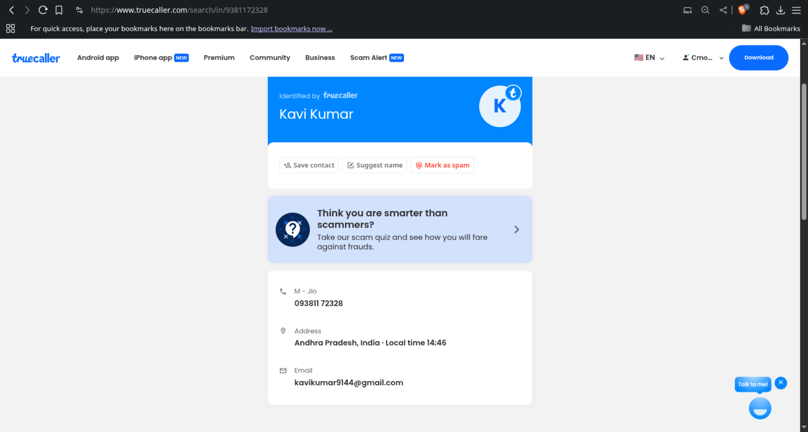

# 📱 Android Malware Analysis — Fake CSC Group App (`Aayushman.apk`)

This repository documents the static and dynamic analysis of a suspicious Android application (`Aayushman.apk`) which impersonates the legitimate CSC Group or Ayushman Bharat app. The investigation reveals potential malicious behavior, including SMS interception and unauthorized data access.

---

## 🧾 App Metadata

- **App Name:** CSC Group
- **Package Name:** `com.shootii.rooomu`
- **APK File:** `Aayushman.apk`
- **Source Extracted:** `Aayushman_apktool/` (via Apktool)
- **Decompiler Used:** JADX, Ghidra
- **Signed:** Yes (v1, v2, v3)

---

## 📛 Suspicious Indicators

- **Hardcoded Phone Number:** `+91 9381172328`
- **Identified Email (via Truecaller):** `kavikumar9144@gmail.com`
- **Masquerades as:** Government welfare/communication apps
- **Dangerous Permissions Requested:**
  - `READ_SMS`, `RECEIVE_SMS`, `SEND_SMS`
  - `READ_PHONE_STATE`, `CALL_PHONE`
  - `INTERNET`, `ACCESS_NETWORK_STATE`
- **Suspicious Receivers:**
  - `S1m2s3R4e5c6e7i8v9e0r`
  - `S1m2s3L4i5s6t7n8e9r0`
- **Firebase Components Present:** Suggests remote communication or data sync

---

## 📂 Key Components in Manifest

```xml
<receiver android:name="com.shootii.rooomu.S1m2s3R4e5c6e7i8v9e0r"
    android:enabled="true" android:exported="true"
    android:permission="android.permission.BROADCAST_SMS">
    <intent-filter>
        <action android:name="android.provider.Telephony.SMS_RECEIVED"/>
    </intent-filter>
</receiver>
```

- These receivers can intercept SMS and potentially extract OTPs or sensitive content.

---

## 🧪 Analysis Setup

| Tool         | Purpose                          |
|--------------|----------------------------------|
| **Apktool**  | Decompiled resources + manifest  |
| **JADX**     | Decompiled Java code             |
| **Ghidra**   | Low-level smali/native inspection|
| **LSPosed**  | Hooking functions at runtime     |
| **Magisk**   | Root access for dynamic analysis |

---

## 🚩 Behavior Summary

- Reads all incoming SMS using broadcast receivers
- Sends or forwards information (e.g., OTPs) to hardcoded number
- Uses Firebase and permissions to remain persistent and undetected
- May spoof government interfaces to gain user trust
- Disables app icon to hide from user

---

## 🖼️ Screenshots

### Truecaller Search


### Screenshot of details found


---

## 📌 IOC (Indicators of Compromise)

- **APK hash:** *sha256sum Aayushman.apk                    
ee947e225bc48f1fab4db8fce79a91be4ae3f6c9da7fab23806e0f43912fd482*
- **Phone number:** `+91 9381172328`
- **Email address:** `kavikumar9144@gmail.com`
- **Package name:** `com.shootii.rooomu`

---

## 🛡️ Recommendations

- Treat the app as **malicious**
- Block the listed phone number and email in endpoints
- Notify relevant authorities or CERT-In (India)
- Educate users on phishing via SMS-based app clones

---

## ✍️ Author

- Malware reversed by `ayusman`
- Contact: *https://github.com/IC7400A*

---

## 📝 Disclaimer

This project is for educational and informational purposes only. Do not use this knowledge for unethical activities.
